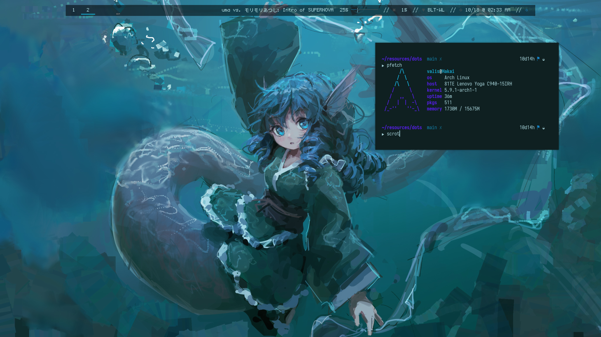

# dots
dotfiles for my current linux setup

these are derived from an older configuration I had running, but cleaned up and made more... useful?
at least they should run better universally.

theming and such is generated thanks to [pywal](https://github.com/dylanaraps/pywal), without which doing anything color related would be pain.

current background borrowed from [@redi_n8 on twitter](https://twitter.com/redi_n8/status/1263877757072785408)
